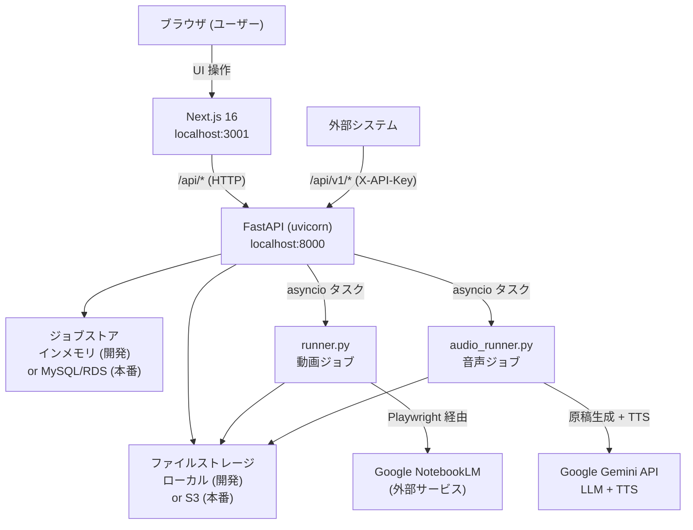

# NoteVideo 開発進捗レポート

**作成日**: 2026-03-05  
**対象読者**: 担当エンジニア

---

## 1. プロジェクト概要

**NoteVideo** は、業務データ CSV を Google NotebookLM にアップロードして AI が生成した解説動画 (MP4) をダウンロードできる Web アプリケーションです。また **Gemini API** を使った音声解説 (WAV) 生成モードも備えています。

| 項目 | 内容 |
|------|------|
| リポジトリ名 | `notebooklm-csv-to-video` |
| 主要技術 | Python (FastAPI) + Next.js 16 + notebooklm-py + Google Gemini API |
| 動画生成エンジン | Google NotebookLM (非公式 API、Playwright 経由) |
| 音声生成エンジン | Google Gemini LLM (gemini-2.5-flash) + TTS (gemini-2.5-flash-preview-tts) |
| 現在のステータス | **ローカル開発環境で E2E 動作確認済み** |

---

## 2. システムアーキテクチャ



### 処理フロー: CSV → MP4 (動画生成)

```
[1] ジョブ作成     POST /api/jobs (CSV アップロード)
[2] ノートブック作成  NotebookLMClient.notebooks.create()
[3] CSV ソース追加  sources.add_file() → インデックス完了待機 (最大 300 秒)
[4] 動画生成開始   artifacts.generate_video()
[5] 生成完了待機   artifacts.wait_for_completion() (最大 timeout 秒)
[6] MP4 保存      ローカル or S3 に保存
[7] 完了通知      Webhook (callback_url 指定時)
```

### 処理フロー: CSV → WAV (音声生成)

```
[1] ジョブ作成     POST /api/audio-jobs (CSV アップロード)
[2] CSV 読み込み   UTF-8 / Shift-JIS 自動判定
[3] 原稿生成      Gemini LLM (gemini-2.5-flash) で解説原稿を生成
[4] 音声生成      Gemini TTS (gemini-2.5-flash-preview-tts) で WAV 生成
[5] WAV 保存      ローカル or S3 に保存
[6] 完了通知      Webhook (callback_url 指定時)
```

---

## 3. 実装済み機能一覧

### 3-1. CLI スクリプト (ルートディレクトリ)

| ファイル | 機能 | 状態 |
|---------|------|------|
| `generate_video_from_csv.py` | CSV 1件から MP4 を一括生成 (5ステップ) | **完了・動作確認済み** |
| `create_notebook_from_csvs.py` | 複数 CSV をノートブックにまとめる | **完了** |

### 3-2. バックエンド API (FastAPI)

**フロントエンド用エンドポイント (`/api/`)** — 認証不要

| メソッド | パス | 機能 |
|---------|------|------|
| GET | `/api/auth/status` | NotebookLM 認証状態取得 |
| POST | `/api/auth/login` | 再ログイン起動 (Playwright ブラウザ起動) |
| GET | `/api/jobs/stats` | ジョブ統計 (total / processing / completed / error) |
| GET | `/api/jobs` | ジョブ一覧 (`?status=` / `?type=` フィルタ対応) |
| GET | `/api/jobs/{id}` | ジョブ詳細 + ステップ進捗 |
| POST | `/api/jobs` | 動画ジョブ作成 (CSV multipart アップロード) |
| GET | `/api/jobs/{id}/download` | MP4 / WAV ダウンロード (jobType に応じて自動判定) |
| POST | `/api/audio-jobs` | 音声ジョブ作成 (CSV multipart アップロード) |

**外部 API (`/api/v1/`)** — `X-API-Key` 認証必須

| メソッド | パス | 機能 |
|---------|------|------|
| POST | `/api/v1/jobs` | 動画ジョブ作成 (JSON: Base64 または file_path で CSV 指定) |
| GET | `/api/v1/jobs` | ジョブ一覧 |
| GET | `/api/v1/jobs/{id}` | ジョブ状態取得 |
| GET | `/api/v1/jobs/{id}/download` | MP4 ダウンロード |
| POST | `/api/v1/audio-jobs` | 音声ジョブ作成 (JSON: Base64 または file_path で CSV 指定) |
| GET | `/api/v1/audio-jobs/{id}` | 音声ジョブ状態取得 (`generatedScript` フィールドで原稿確認可) |
| GET | `/api/v1/audio-jobs/{id}/download` | WAV ダウンロード |

### 3-3. バックエンドモジュール

| ファイル | 役割 | 状態 |
|---------|------|------|
| `backend/main.py` | FastAPI アプリ本体、ルーティング、同時実行制御 (Semaphore=3) | **完了** |
| `backend/api_v1.py` | 外部 API ルーター (動画 + 音声ジョブ) | **完了** |
| `backend/runner.py` | 動画バックグラウンドジョブ実行、NotebookLM 操作、Webhook 呼び出し | **完了** |
| `backend/audio_runner.py` | 音声バックグラウンドジョブ実行、Gemini LLM + TTS 処理、Webhook 呼び出し | **完了** |
| `backend/database.py` | ジョブストア (インメモリ / MySQL 切り替え) | **完了** |
| `backend/storage.py` | ファイル保存 (ローカル / S3 切り替え、MP4 + WAV 対応) | **完了** |
| `backend/webhook.py` | Webhook 送信 (指数バックオフ: 5/15/45 秒、最大 3 回) | **完了** |
| `backend/auth.py` | API キー認証 (`NOTEVIDEO_API_KEYS` 環境変数) | **完了** |

### 3-4. フロントエンド (Next.js 16 App Router)

**ページ構成**

| パス | 機能 | 状態 |
|------|------|------|
| `/` | ダッシュボード (統計カード + 最近のジョブ) | **完了** |
| `/generate` | 新規動画生成フォーム (CSV アップロード + スタイル選択) | **完了** |
| `/generate-audio` | 新規音声生成フォーム (CSV アップロード + ボイス選択 + 指示文プリセット) | **完了** |
| `/jobs` | 生成履歴一覧 (フィルタ + テーブル) | **完了** |
| `/jobs/[id]` | ジョブ詳細 (ステップ進捗 + ダウンロード、動画/音声両対応) | **完了** |

**コンポーネント一覧**

| カテゴリ | コンポーネント |
|---------|--------------|
| レイアウト | `sidebar.tsx`, `header.tsx`, `sidebar-item.tsx` |
| ダッシュボード | `stats-cards.tsx`, `recent-jobs.tsx` |
| 動画生成 | `generate-form.tsx`, `csv-upload.tsx`, `style-selector.tsx`, `format-selector.tsx` |
| 音声生成 | `audio-generate-form.tsx`, `voice-selector.tsx` |
| ジョブ | `job-table.tsx`, `job-status-badge.tsx`, `job-progress.tsx` |
| shadcn/ui | button, card, input, textarea, select, badge, table, progress, separator, tooltip, label, collapsible |

**カスタムフック**

| フック | 役割 | ポーリング間隔 |
|--------|------|-------------|
| `useJobStats()` | 統計取得 | 10 秒 |
| `useJobs(status?)` | ジョブ一覧 | 10 秒 |
| `useJob(id)` | ジョブ詳細 | 5 秒 (処理中のみ) |
| `useGenerateVideo()` | 動画ジョブ作成 mutation | — |
| `useGenerateAudio()` | 音声ジョブ作成 mutation | — |
| `useAuthStatus()` | 認証状態 | 30 秒 |
| `useTriggerLogin()` | 再ログイン mutation | — |

**lib ファイル**

| ファイル | 役割 |
|---------|------|
| `lib/api.ts` | API クライアント (モック切り替え対応、動画・音声ジョブ両対応) |
| `lib/types.ts` | 型定義 (`Job`, `AudioStep`, `VoiceOption`, `VOICE_OPTIONS` 等) |
| `lib/instruction-presets.ts` | 指示文プリセット定義 (走行実績サマリー / 安全運転評価 / 燃費・エコ走行 / アイドリング・時間外 / カスタム) |
| `lib/date-utils.ts` | 日付フォーマットユーティリティ |
| `lib/utils.ts` | 汎用ユーティリティ |

### 3-5. AWS デプロイ設定 (`deploy/` ディレクトリ)

| ファイル | 内容 |
|---------|------|
| `DEPLOY.md` | AWS (EC2/RDS/S3) へのデプロイ詳細手順書 |
| `setup.sh` | EC2 Ubuntu セットアップ自動化スクリプト |
| `nginx.conf` | Nginx リバースプロキシ設定 (HTTP→HTTPS リダイレクト、タイムアウト 1800 秒) |
| `iam_policy.json` | S3 アクセス用 EC2 IAM ポリシー |
| `notevideo-backend.service` | systemd バックエンドサービスユニット |
| `notevideo-frontend.service` | systemd フロントエンドサービスユニット |

---

## 4. 技術スタック

### バックエンド

| 技術 | バージョン | 用途 |
|-----|-----------|------|
| Python | 3.10+ | 実行環境 |
| FastAPI | >=0.135.0 | Web API フレームワーク |
| uvicorn | >=0.34.0 | ASGI サーバー |
| notebooklm-py | 0.3.3 (最新) | NotebookLM 操作 (Playwright + Chromium) |
| google-genai | 最新 | Gemini LLM 原稿生成 + TTS 音声生成 |
| boto3 | >=1.35.0 | AWS S3 連携 |
| aiomysql | >=0.2.0 | MySQL 非同期接続 |
| httpx | >=0.28.0 | Webhook HTTP クライアント |

### フロントエンド

| 技術 | バージョン | 用途 |
|-----|-----------|------|
| Next.js | 16.1.6 | React フレームワーク (App Router) |
| React | 19.2.3 | UI ライブラリ |
| TypeScript | 5 | 型付け |
| Tailwind CSS | v4 | スタイリング |
| shadcn/ui + Radix UI | — | UI コンポーネント |
| TanStack React Query | v5 | サーバー状態管理 |
| React Hook Form + Zod | — | フォームバリデーション |
| Lucide React | — | アイコン |

### インフラ (本番)

| 技術 | 用途 |
|-----|------|
| AWS EC2 (t3.medium+, Ubuntu 22.04) | アプリケーションサーバー |
| AWS RDS (MySQL 8.0) | ジョブデータ永続化 |
| AWS S3 | CSV / MP4 / WAV ファイルストレージ |
| Nginx | リバースプロキシ / HTTPS 終端 |
| Let's Encrypt | SSL 証明書 |
| systemd | サービス管理 |

---

## 5. 開発環境の現状

| 項目 | 状況 |
|------|------|
| バックエンド | `localhost:8000` 稼働中 (インメモリモード、DATABASE_URL 未設定) |
| フロントエンド | `localhost:3001` 稼働中 (バックエンド接続済み、`NEXT_PUBLIC_USE_MOCK=false`) |
| NotebookLM 認証 | 認証済み (`~/.notebooklm/storage_state.json` 保存済み) |
| Gemini API | `GEMINI_API_KEY` 設定済み (音声生成モード利用可能) |
| E2E 動作確認 | **完了** (動画: CSV アップロード → MP4 生成 → ダウンロード確認済み) |

---

## 6. 既知の課題・注意点

### 高優先度

| # | 課題 | 詳細 |
|---|------|------|
| 1 | **notebooklm-py ライブラリのローカルパッチ** | `_artifacts.py` の `_is_media_ready` メソッドにある VIDEO タイプの URL 判定バグをローカル venv 内で直接修正済み。`pip install --upgrade notebooklm-py` を実行するとパッチが上書きされる。EC2 デプロイ時は同じパッチを再適用すること。**修正内容**: `item[0]` を直接 URL として検証していたが、実際の構造は `item[0][0]` が URL のネストリストのため、1 段階深く参照するよう変更。 |
| 2 | **Git リポジトリ未初期化** | プロジェクトルートで `git init` および GitHub へのプッシュがまだ実施されていない。デプロイ前に対応必須。 |

### 中優先度

| # | 課題 | 詳細 |
|---|------|------|
| 3 | **`main.py` docstring の DB 記載誤り** | 6行目に「PostgreSQL（RDS）」と記載されているが、実装は MySQL (aiomysql)。ドキュメント修正が必要。 |
| 4 | **フロントエンドのエラートースト未実装** | `hooks/use-generate.ts` の `useGenerateVideo` mutation に `onError` ハンドラが実装されておらず、ジョブ作成失敗時にユーザーへの通知が表示されない。 |
| 5 | **Docker / docker-compose なし** | コンテナ化設定が存在しないため、環境構築の再現性が低い。本番では systemd で代替しているが、ローカル開発の手順が手動。 |

### 低優先度

| # | 課題 | 詳細 |
|---|------|------|
| 6 | **notebooklm-py は非公式ライブラリ** | Google の内部 API を利用しているため、Google 側の仕様変更でいつでも動作しなくなる可能性がある。ライブラリは定期的に更新を確認すること。 |
| 7 | **Google セッション有効期限** | `~/.notebooklm/storage_state.json` の Cookie は定期的に期限切れになる。EC2 上で再ログイン手順が必要になる場合がある。フロントエンドのヘッダーに認証状態インジケータを実装済み。 |

---

## 7. 本番デプロイ向けチェックリスト

### Step 1: コードのバージョン管理

- [ ] プロジェクトルートで `git init`
- [ ] `.gitignore` に `uploads/`, `outputs/`, `.venv/`, `.env`, `*.mp4`, `*.wav` 等を追加
- [ ] GitHub リポジトリを作成してプッシュ

### Step 2: AWS インフラ構築 (詳細は `deploy/DEPLOY.md` 参照)

- [ ] S3 バケット作成 (`notevideo-files-prod`, ap-northeast-1)
- [ ] RDS MySQL 8.0 作成 (`notevideo-db`)
- [ ] EC2 インスタンス作成 (Ubuntu 22.04, t3.medium 以上, 30GB)
- [ ] IAM ロール作成・EC2 にアタッチ (`deploy/iam_policy.json`)

### Step 3: EC2 セットアップ

- [ ] `deploy/setup.sh` を実行 (事前に `REPO_URL` と `DOMAIN` を編集)
- [ ] notebooklm-py のパッチを再適用 (`_artifacts.py` の `_is_media_ready` 修正)
- [ ] 環境変数を `/opt/notevideo/backend/.env` に設定

```env
AWS_REGION=ap-northeast-1
S3_BUCKET_NAME=notevideo-files-prod
DATABASE_URL=mysql+aiomysql://user:password@{rds-endpoint}:3306/notevideo
NOTEVIDEO_API_KEYS=prod-api-key-1,prod-api-key-2
CORS_ALLOWED_ORIGINS=https://{本番ドメイン}
GEMINI_API_KEY=your_gemini_api_key
```

### Step 4: NotebookLM 認証

- [ ] EC2 に SSH ポートフォワーディングでログイン
- [ ] `source /opt/notevideo/backend/.venv/bin/activate && notebooklm login` を実行
- [ ] ブラウザで Google アカウントにログイン、`~/.notebooklm/storage_state.json` が生成されることを確認

### Step 5: サービス起動・確認

- [ ] systemd サービスを有効化・起動 (`notevideo-backend.service`, `notevideo-frontend.service`)
- [ ] `GET /api/auth/status` が `authenticated` を返すことを確認
- [ ] フロントエンドから動画ジョブを投入し MP4 生成が完了することを確認
- [ ] フロントエンドから音声ジョブを投入し WAV 生成が完了することを確認
- [ ] HTTPS でアクセスできることを確認
- [ ] S3 から MP4 / WAV がダウンロードできることを確認

---

## 8. 環境変数一覧

### バックエンド (`backend/.env`)

| 変数 | 必須 | デフォルト | 説明 |
|------|------|-----------|------|
| `DATABASE_URL` | 本番のみ | — | MySQL 接続文字列 (未設定時はインメモリ) |
| `S3_BUCKET_NAME` | 本番のみ | — | S3 バケット名 (未設定時はローカル保存) |
| `AWS_REGION` | S3 使用時 | `ap-northeast-1` | AWS リージョン |
| `AWS_ACCESS_KEY_ID` | ローカルのみ | — | EC2 IAM ロール使用時は不要 |
| `AWS_SECRET_ACCESS_KEY` | ローカルのみ | — | EC2 IAM ロール使用時は不要 |
| `NOTEVIDEO_API_KEYS` | 外部 API 使用時 | — | カンマ区切りの API キー |
| `CORS_ALLOWED_ORIGINS` | 本番のみ | `http://localhost:3000` | CORS 許可オリジン |
| `GEMINI_API_KEY` | 音声生成使用時 | — | Google AI Gemini API キー ([取得先](https://aistudio.google.com/apikey)) |

### フロントエンド (`frontend/.env.local`)

| 変数 | 値 (開発) | 値 (本番) | 説明 |
|------|----------|----------|------|
| `NEXT_PUBLIC_USE_MOCK` | `false` | `false` | モックモード (false = バックエンド接続) |
| `NEXT_PUBLIC_API_URL` | `http://localhost:8000/api` | `https://{ドメイン}/api` | バックエンド API URL |

---

## 9. ファイル構成一覧

```
notebooklm-csv-to-video/
├── README.md                          # CLI スクリプト利用手順・音声生成手順
├── requirements.txt                   # notebooklm-py[browser]
├── generate_video_from_csv.py         # CSV→MP4 一括生成 CLI
├── create_notebook_from_csvs.py       # ノートブック作成 CLI
│
├── backend/                           # FastAPI バックエンド
│   ├── main.py                        # アプリ本体、フロント用 API (動画 + 音声ジョブ)
│   ├── api_v1.py                      # 外部 API v1 ルーター (動画 + 音声ジョブ)
│   ├── runner.py                      # 動画バックグラウンドジョブ実行
│   ├── audio_runner.py                # 音声バックグラウンドジョブ実行 (Gemini LLM + TTS)
│   ├── database.py                    # ジョブストア (インメモリ/MySQL)
│   ├── storage.py                     # ファイル保存 (ローカル/S3、MP4 + WAV 対応)
│   ├── webhook.py                     # Webhook 送信
│   ├── auth.py                        # API キー認証
│   ├── requirements.txt               # Python 依存関係
│   └── .env.example                   # 環境変数サンプル
│
├── frontend/                          # Next.js フロントエンド
│   ├── app/
│   │   ├── layout.tsx                 # ルートレイアウト
│   │   ├── page.tsx                   # ダッシュボード
│   │   ├── globals.css
│   │   ├── generate/page.tsx          # 新規動画生成フォーム
│   │   ├── generate-audio/page.tsx    # 新規音声生成フォーム
│   │   └── jobs/
│   │       ├── page.tsx               # ジョブ一覧
│   │       └── [id]/page.tsx          # ジョブ詳細 (動画/音声両対応)
│   ├── components/
│   │   ├── layout/                    # sidebar, header, sidebar-item
│   │   ├── dashboard/                 # stats-cards, recent-jobs
│   │   ├── generate/                  # generate-form, csv-upload, style-selector, format-selector
│   │   ├── generate-audio/            # audio-generate-form, voice-selector
│   │   ├── jobs/                      # job-table, job-status-badge, job-progress
│   │   ├── providers.tsx              # React Query プロバイダー
│   │   └── ui/                        # shadcn/ui コンポーネント群
│   ├── hooks/
│   │   ├── use-auth.ts
│   │   ├── use-jobs.ts
│   │   ├── use-generate.ts
│   │   └── use-generate-audio.ts
│   ├── lib/
│   │   ├── api.ts                     # API クライアント (モック切り替え対応)
│   │   ├── types.ts                   # 型定義 (Job, AudioStep, VoiceOption 等)
│   │   ├── instruction-presets.ts     # 指示文プリセット定義
│   │   ├── date-utils.ts
│   │   └── utils.ts
│   ├── next.config.ts                 # standalone 出力設定
│   ├── package.json
│   ├── .env.local                     # ローカル開発用環境変数
│   └── .env.production.example       # 本番用環境変数サンプル
│
├── deploy/                            # AWS デプロイ設定
│   ├── DEPLOY.md                      # デプロイ手順書
│   ├── setup.sh                       # EC2 セットアップスクリプト
│   ├── nginx.conf                     # Nginx 設定
│   ├── iam_policy.json                # S3 用 IAM ポリシー
│   ├── notevideo-backend.service      # systemd バックエンド
│   └── notevideo-frontend.service     # systemd フロントエンド
│
└── docs/                              # ドキュメント
    ├── external-api.md                # 外部 API 仕様書
    └── progress-report.md             # 本レポート
```

---

## 10. 参考リンク・ドキュメント

| ドキュメント | パス |
|-----------|------|
| 外部 API 仕様書 | [docs/external-api.md](external-api.md) |
| AWS デプロイ手順書 | [deploy/DEPLOY.md](../deploy/DEPLOY.md) |
| CLI 利用手順 (README) | [README.md](../README.md) |
| notebooklm-py ライブラリ | https://github.com/teng-lin/notebooklm-py |
| Google AI Studio (Gemini API キー発行) | https://aistudio.google.com/apikey |
