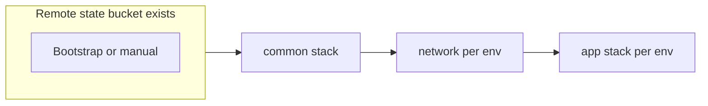

# Infra (GCP)

Infrastructure as code and GCP operations documentation for Mitene. This page is the **canonical runbook** for Terraform: login, stack order, remote backends, and `-var-file` usage. For app module details (variables, Cloud Run, Cloud SQL, images, schedules), see [terraform/README.md](terraform/README.md).

## Table of contents

- [Topic index](#topic-index)
- [Prerequisites](#prerequisites)
- [GCP login and project selection](#gcp-login-and-project-selection)
- [Remote state bucket (one-time)](#remote-state-bucket-one-time)
- [Backend configuration by stack](#backend-configuration-by-stack)
- [Recommended apply order](#recommended-apply-order)
- [Stack overview](#stack-overview)
- [Runbooks by directory](#runbooks-by-directory)
  - [Bootstrap](#bootstrap)
  - [Common](#common)
  - [Network](#network)
  - [App stack](#app-stack)
- [Switching environments on the same clone](#switching-environments-on-the-same-clone)
- [Internal policy wiki (optional)](#internal-policy-wiki-optional)
- [Related documentation](#related-documentation)

## Topic index

| Topic | Path |
|-------|------|
| Terraform app stack (Artifact Registry, Cloud Run, GCS, Cloud SQL, variables) | [terraform/README.md](terraform/README.md) |
| Cloud Build + deploy (dev/prod) | [scripts/gcp/README.md](../scripts/gcp/README.md), [cloudbuild/](../cloudbuild/), [cloudbuild/GITHUB_ACTIONS_WIF.md](../cloudbuild/GITHUB_ACTIONS_WIF.md) |
| Cloud Run runbook (repo) | [../deploy/CLOUD_RUN.md](../deploy/CLOUD_RUN.md) |

> This directory is named **`infra`**. If your internal tickets use another name, your team can add an alias or symlink as needed.

## Prerequisites

- [Terraform](https://www.terraform.io/) `>= 1.5`
- [Google Cloud SDK](https://cloud.google.com/sdk) (`gcloud`) with permission to create resources in the target GCP project(s)

## GCP login and project selection

Run these **before** any `terraform` that talks to GCP:

1. **`gcloud auth login`** — browser flow; authorizes the `gcloud` CLI as your user.
2. **`gcloud auth application-default login`** — writes Application Default Credentials. The Terraform Google provider uses these for API calls (see also [terraform/README.md](terraform/README.md) prerequisites).
3. **`gcloud config set project PROJECT_ID`** — default project for `gcloud`. Use:
   - **common** project for `terraform/bootstrap/` and `terraform/common/`.
   - **dev / stg / prod** app project for `terraform/network/` and the app stack under `terraform/` for that environment.

Optional: use **`gcloud config configurations`** for multiple named profiles when you switch projects often.

Verify access: **`gcloud projects describe PROJECT_ID`**.

## Remote state bucket (one-time)

The GCS **`terraform` backend** expects the bucket to **already exist**; `terraform init` with `backend "gcs"` will fail until the bucket is created.

Choose **one** approach:

| Approach | Where | Notes |
|----------|--------|--------|
| **A — Bootstrap stack** | [terraform/bootstrap/](terraform/bootstrap/README.md) | Copy `terraform.tfvars.example` → `terraform.tfvars`, then `terraform init` → `terraform apply`. Uses **local** state on purpose; only creates the bucket. |
| **B — Manual** | Console or `gcloud` | Examples: [terraform/bootstrap/README.md](terraform/bootstrap/README.md) (`gcloud storage buckets create`, versioning, uniform access). |

Use a **globally unique** bucket name (for example `{common_project_id}-terraform-state`). The bucket usually lives in the **common** project and holds **all** remote states; stacks and environments differ by **`prefix`**, not by bucket.

## Backend configuration by stack

| Stack | Directory | GCP project (typical) | Backend pattern | Init |
|-------|-----------|------------------------|-----------------|------|
| Bootstrap | `terraform/bootstrap/` | common | **None** (local `.tfstate`) | `terraform init` |
| Common | `terraform/common/` | common | Full `backend "gcs"` in `backend.tf` (`bucket` + `prefix`) | `terraform init` |
| Network | `terraform/network/` | dev / stg / prod (per env) | **Partial** `backend "gcs" {}`; bucket/prefix from `backend.tf.<env>` | `terraform init -reconfigure -backend-config=backend.tf.<env>` |
| App | `terraform/` | dev / stg / prod (per env) | Full `backend "gcs"` in `backend.tf` (`bucket` + `prefix`) in repo; see [terraform/backend.tf](terraform/backend.tf) | `terraform init`; after changing `backend.tf` (e.g. `prefix`), use `terraform init -reconfigure` |

**Network stack:** [terraform/network/backend.tf](terraform/network/backend.tf) declares an empty `backend "gcs" {}`. You pass `bucket` and `prefix` at init time via `-backend-config=backend.tf.dev` or `backend.tf.prod` (see [terraform/network/backend.tf.dev](terraform/network/backend.tf.dev) pattern).

**App stack:** [terraform/backend.tf](terraform/backend.tf) embeds `bucket` and `prefix` (example: `app/dev`). Repository files [terraform/backend.tf.dev](terraform/backend.tf.dev) and [terraform/backend.tf.prod](terraform/backend.tf.prod) use the **same key=value format** as network’s backend-config files. They are useful if you refactor the app stack to a **partial** backend (like network) or as a reference for the correct `bucket`/`prefix` when editing `backend.tf`. They are **not** used automatically unless you change the app `backend` block to partial `backend "gcs" {}` and pass `-backend-config`.

For every stack that uses remote state, copy **`backend.tf.example`** → **`backend.tf`** where applicable, set **`bucket`** to your state bucket, and set **`prefix`** to a **unique** path per stack and environment. Do not reuse the same `prefix` for two different states.

## Recommended apply order

Use this order the first time you bring up GCP for this project.



1. **Bootstrap** (optional) — create the GCS state bucket.
2. **`terraform/common/`** — shared Artifact Registry and reader IAM for app projects. Example state prefix: `common/main`. See [terraform/common/README.md](terraform/common/README.md).
3. **`terraform/network/`** — once **per** environment that needs VPC / private Cloud SQL. Example prefix: `network/dev`. See [terraform/network/README.md](terraform/network/README.md). Skip if you are not using Cloud SQL / VPC yet.
4. **App stack** (`terraform/`) — Cloud Run, optional GCS, Cloud SQL, etc., **per** environment. Set **`create_artifact_registry = false`** and point image URLs at the common registry when the registry was created in `common/`. If **`enable_cloud_sql = true`**, apply **`network/`** first, then set **`network_remote_state_bucket`** and **`network_remote_state_prefix`** in the app `tfvars` to match the network state (see [terraform/README.md](terraform/README.md)).

After infrastructure exists, build and deploy images with [Cloud Build](../cloudbuild/) and [scripts/gcp](../scripts/gcp/README.md).

## Stack overview

| Stack | Path | State prefix example | GCP project (four-project layout) |
|-------|------|----------------------|-----------------------------------|
| Bootstrap | `terraform/bootstrap/` | — (local state) | common |
| Common | `terraform/common/` | `common/main` | common |
| Network | `terraform/network/` | `network/dev`, `network/stg`, `network/prod` | dev / stg / prod |
| App | `terraform/` | `app/dev`, `app/stg`, `app/prod` | dev / stg / prod |

## Runbooks by directory

### Bootstrap

**Directory:** `terraform/bootstrap/`

**Purpose:** Create the GCS bucket used by all remote Terraform states.

**Project:** Set `gcloud` to the **common** project.

**Files:** Copy [terraform/bootstrap/terraform.tfvars.example](terraform/bootstrap/terraform.tfvars.example) → `terraform.tfvars` (gitignored). Set `project_id`, `region`, `state_bucket_name`.

**Backend:** None — local state in this directory only.

**Commands:**

```bash
cd terraform/bootstrap
terraform init
terraform apply
```

**Notes:** See [terraform/bootstrap/README.md](terraform/bootstrap/README.md) for manual bucket creation if you skip this stack.

---

### Common

**Directory:** `terraform/common/`

**Purpose:** Shared Docker Artifact Registry; grants `roles/artifactregistry.reader` to app projects.

**Project:** **common**.

**Files:** Copy [terraform/common/terraform.tfvars.example](terraform/common/terraform.tfvars.example) → `terraform.tfvars`. Set `project_id`, `region`, `reader_project_ids`.

**Backend:** Copy [terraform/common/backend.tf.example](terraform/common/backend.tf.example) → `backend.tf`. Set `bucket` to your state bucket and `prefix = "common/main"` (or equivalent).

**Commands:**

```bash
cd terraform/common
terraform init
terraform plan -var-file=terraform.tfvars
terraform apply -var-file=terraform.tfvars
```

---

### Network

**Directory:** `terraform/network/`

**Purpose:** VPC, subnet, Private Service Access for Cloud SQL private IP (consumed by the app stack via remote state).

**Project:** The **environment** project (dev / stg / prod) that matches `env_suffix` in your tfvars.

**Files:** Copy [terraform/network/terraform.tfvars.example](terraform/network/terraform.tfvars.example) → `terraform.tfvars.dev` and/or `terraform.tfvars.prod` (or a single `terraform.tfvars`). Adjust `project_id`, `region`, `env_suffix` per environment.

**Backend:** Edit or add `backend.tf.dev` / `backend.tf.prod` with your `bucket` and a unique `prefix` (e.g. `network/dev`). The [terraform/network/backend.tf](terraform/network/backend.tf) block is empty `backend "gcs" {}`.

**Commands (example: dev):**

```bash
cd terraform/network
terraform init -reconfigure -backend-config=backend.tf.dev
terraform plan -var-file=terraform.tfvars.dev
terraform apply -var-file=terraform.tfvars.dev
```

**Notes:** Use the **same** `env` for `backend.tf.<env>` and `terraform.tfvars.<env>`. Destroy order: destroy the **app** stack before the network stack.

---

### App stack

**Directory:** `terraform/` (repository root of the app Terraform module)

**Purpose:** Cloud Run, optional GCS, Cloud SQL, Scheduler, etc., for one environment per configuration.

**Project:** The **environment** app project (dev / stg / prod).

**Files:** Copy [terraform/terraform.tfvars.example](terraform/terraform.tfvars.example) → `terraform.tfvars.dev` and/or `terraform.tfvars.prod` (or `terraform.tfvars`). Set `project_id`, `env_suffix`, `container_image`, and other variables. Do not commit secrets.

**Backend:** Ensure [terraform/backend.tf](terraform/backend.tf) has the correct `bucket` and `prefix` for this environment (e.g. `app/dev` vs `app/prod`). Copy from [terraform/backend.tf.example](terraform/backend.tf.example) if you are setting up from scratch.

**Commands (recommended: separate var files per env):**

```bash
cd terraform
terraform init
terraform plan -var-file=terraform.tfvars.dev
terraform apply -var-file=terraform.tfvars.dev
```

**Notes:**

- **Option A:** `terraform.tfvars.dev` and `terraform.tfvars.prod` with `terraform apply -var-file=...` (matches [terraform/README.md](terraform/README.md)).
- **Option B:** Terraform workspace + `*.auto.tfvars`.
- With **`create_artifact_registry = false`**, image URLs must use the common project registry (see `common/`).
- If **`enable_cloud_sql = true`**, apply **`network/`** first and set **`network_remote_state_*`** in app tfvars.

## Switching environments on the same clone

- After you change **`backend.tf`** (`bucket` or `prefix`) or switch **`-backend-config`** files (network), run **`terraform init -reconfigure`** before `plan` / `apply`.
- Never reuse the same **`prefix`** for different environments (e.g. dev and prod must differ).
- Align **`gcloud config set project`** with the stack you are applying.

## Internal policy wiki (optional)

Org-wide naming, tiers, and governance may live in [wiki.md](wiki.md). This README is the operational entry point for this repo’s Terraform layout.

## Related documentation

| Topic | Path |
|-------|------|
| Terraform app stack (deep dive) | [terraform/README.md](terraform/README.md) |
| Bootstrap | [terraform/bootstrap/README.md](terraform/bootstrap/README.md) |
| Common stack | [terraform/common/README.md](terraform/common/README.md) |
| Network stack | [terraform/network/README.md](terraform/network/README.md) |
| Cloud Build + deploy | [scripts/gcp/README.md](../scripts/gcp/README.md), [cloudbuild/](../cloudbuild/) |
| Manual Cloud Run | [deploy/CLOUD_RUN.md](../deploy/CLOUD_RUN.md) |
